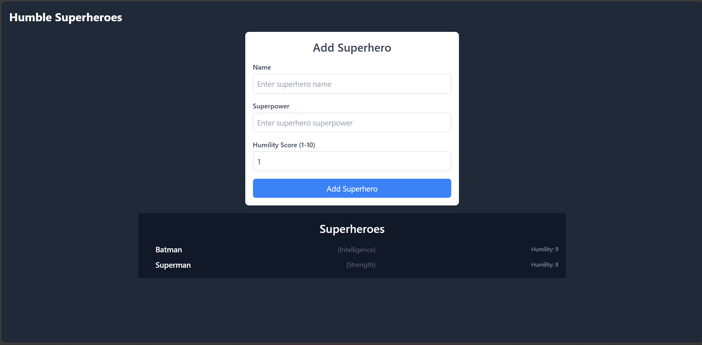
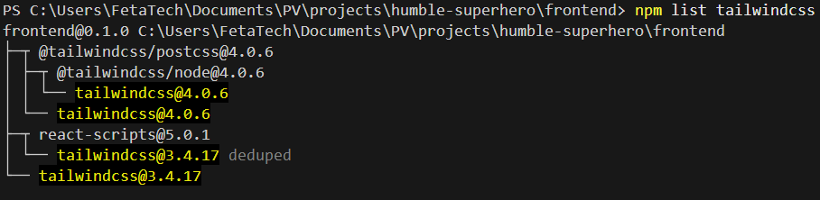

# Humble Superhero APP 🦸‍♂️🦸‍♀️

## Overview

This is a full-stack application built with **NestJS** (backend) and **React** (frontend). It celebrates the superhero in all of us by allowing users to add and view superheroes sorted by their humility score.
**Not all heroes wear capes. Some heroes quietly shape the world through humility and kindness. Humble Superhero App lets you celebrate real and fictional heroes—not for their strength, but for their character. Discover, rank, and appreciate the true superheroes among us!**

---

## 🛠️ Tech Stack

| Frontend | Backend   | Styling         | Testing | Docs       |
| -------- | --------- | --------------- | ------- | ---------- |
| React ⚛️ | NestJS 🚀 | Tailwind CSS 🎨 | Jest 🧪 | Swagger 📚 |

## Features ✨

- **Add a Superhero**: Submit a superhero's name, superpower, and humility score (1-10).
- **View Superheroes**: Fetch a list of superheroes sorted by their humility score in descending order.
- **Validation**: Ensures humility scores are between 1 and 10.
- **Testing**: Includes integration tests for the API endpoints.
- **Frontend**: A simple React interface to add and view superheroes in real-time.

## Setup 🚀

1. **Clone the Repository**:

   ```bash
   git clone https://github.com/yonatandevs/humble-superhero.git
   cd humble-superhero

   ```

1. Install dependencies:
   ```bash
   cd backend && npm install
   npm run dev
   cd ../frontend && npm install
   npm run start
   ```

## Access the Application:

- Backend: Runs on http://localhost:4004

- Frontend: Runs on http://localhost:3000

## Testing 🧪

This project includes unit, integration and e2e tests for the backend. Testing ensures the application behaves as expected and helps catch bugs early.

# Backend Tests

- Unit and Integration Tests: Written using Jest and Supertest to test API endpoints.

To run the tests:

```bash
cd backend
npm run test
```

- e2e : Written using Jest and Supertest to test API endpoints.

```bash
cd backend
npm run test:e2e
```

## API Endpoints

- **POST /superheroes**: Add a new superhero.
- **GET /superheroes**: Fetch all superheroes sorted by humility score.

## Front end

- # Tailwind CSS Integration with React

- develop react app with Tailwind CSS. It includes configuration files for PostCSS and Tailwind CSS, ensuring a seamless development experience.
  

## API Documentation 📚

The backend API is documented using **Swagger**. You can access the interactive API documentation at:

👉 [http://localhost:3000/api-docs](http://localhost:3000/api-docs)

## If I Had More Time

- **Database Integration**: Replace the in-memory database with a persistent database like MongoDB or PostgreSQL (I will use TypeORM or Prisma).
- **Authentication**: Add user authentication using JWT or OAuth to secure the API endpoints.
- **Advanced Frontend Features**:
  - Implement editing and deleting superheroes.
  - Add search and filter functionality.
  - Introduce pagination for better performance with large datasets.
- **Real-Time Updates**: Integrate `socket.io` to update the list of superheroes in real-time when a new hero is added.
- **Performance Optimization**:
  - Optimize the API for performance using caching (e.g., Redis).
  - Implement database indexing for faster queries.
- **CI/CD Pipeline**: Set up a CI/CD pipeline to automate testing and deployment.
- **Comprehensive Testing**:
  - Write end-to-end (E2E) for the frontend.
  - Add unit and integration tests for React components using Jest and React Testing Library.
- **Docker Compose**: Set up a `docker-compose.yml` file to run the backend, frontend, and database together in a containerized environment.

## Collaboration

If I were to collaborate with a teammate on this task, I would:

- **Brainstorming**: Collaborate to brainstorm additional features and improvements, such as real-time updates or advanced filtering.
- **Code Reviews**: Conduct regular code reviews to ensure consistency, readability, and adherence to best practices.
- **Pair Programming**: Pair-program to troubleshoot issues or implement complex features, ensuring knowledge sharing and faster problem-solving.
- **Task Management**: Use tools like GitHub Projects or Jira to track progress, assign tasks, and prioritize work.
- **Communication**: Regularly communicate through stand-ups or async updates to ensure alignment and address blockers quickly.
- **Feedback Loop**: Create a feedback loop where we continuously improve the codebase based on team input and user feedback.
- **Division of Work**: Divide tasks based on expertise (e.g., backend vs. frontend) or feature-wise while maintaining open communication and collaboration.

## Lessons Learned

While working on this project, I encountered an issue where Tailwind CSS stopped working unexpectedly. After debugging, I realized it was due to two versions of Tailwind CSS being installed, which created conflicts (React automatically installs Tailwind CSS, and I installed another version manually).  This experience taught me:

- **The Importance of Documentation**: Always refer to the latest documentation before installing or configuring packages.
- **Conflict Resolution**: How to identify and resolve dependency conflicts in a Node.js project.
- **Debugging Skills**: The value of systematic debugging and using tools like `npm ls` to identify version mismatches.
- **Best Practices**: The need to follow best practices when integrating third-party libraries to avoid unexpected issues.
